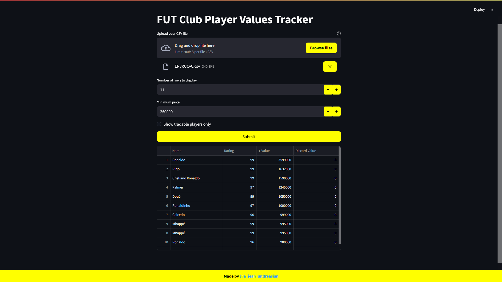
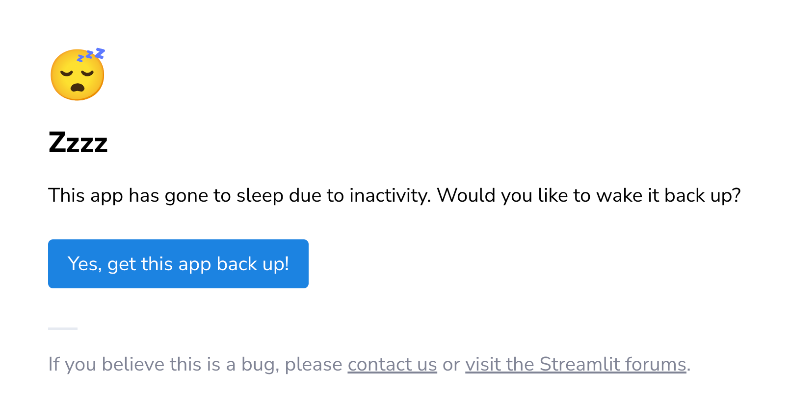
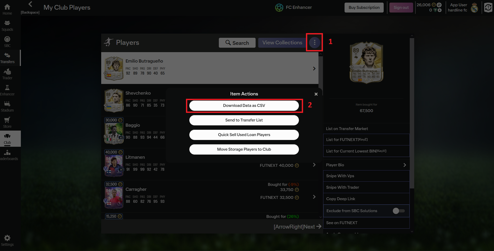

  

---
## What is this?

#### It's an online tool that lets you explore and analyze FIFA/FC Ultimate Team (FUT) club player market values.

The app focuses on:
- Filtering players by **minimum market price**
- Optionally showing only **tradable cards**
- Displaying **discard value** alongside market value
- Sorting by market value (highest first)
- Showing the **top N players** in a clean table

---

## How it works
1. [Upload](#How-to-generate-the-CSV) your exported FUT club CSV file.
2. Set:
    - Number of rows you want to display
    - Minimum market price (default: 250,000)
    - Whether to include only tradables
3. Submit and view the results instantly in a table.

The table includes:
- Player name
- Rating
- Market value (from external pricing sources)
- Discard value (if available in the dataset)

---

## 👉 [Try the app](https://fut-club-player-values-tracker.streamlit.app/)

~

> ### Note: If you see the banner:
> 
>
> ### Click **_"Yes, get this app back up"_** and wait a few seconds for it to load.

---

## Example Use Case
- You want to quickly see which players in your club are currently the **most expensive**.
- You only care about **tradables**, so you exclude untradeables with one click.
- You set the minimum price to 250,000 coins to filter out lower-value players.
- The app then returns your **top players ranked by market value**.

---
## How to generate the CSV

> #### Note: I'm not affiliated with this extension, their developers and do not gurantee anything about it.

If you don't know any ways to export your FUT club data, you can use the **FC Enhancer** browser extension by FutNext.

Then go:
1. Club in your FUT Web App
2. Click on three dots on the right (shown in the screenshot below)
3. Click "Download data as CSV" (shown in the screenshot below)

---

